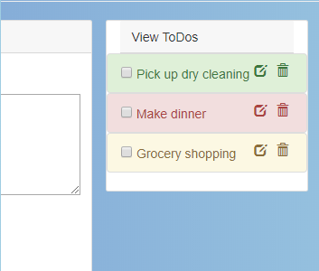

## REACT 100 Very Simple To-Do App

This project was good practice in styling a page using Bootstrap, and then adding functionality to those components using React. This was the big hurdle in the curriculum since I would actually be creating an application from scratch using React for the first time. The lessons I learned in this project were extremely valuable, such as inserting and deleting data in state, handling props, the value of .map, and overall getting comfortable with building an application in React.

### App Screenshot

